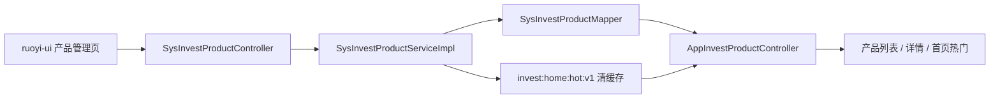
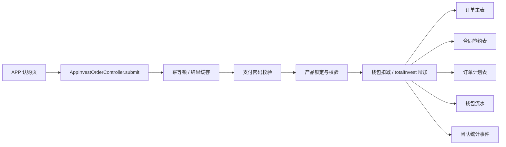
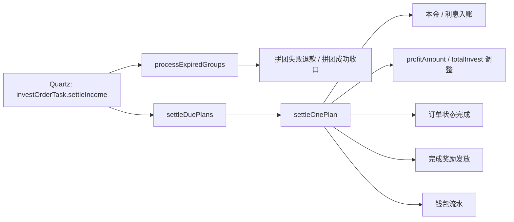
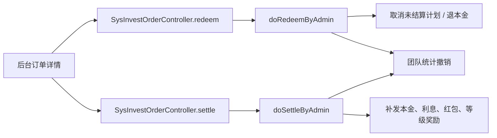

# 产品投资与后台结算地图

> 这份文档只聚焦一条主线：产品怎么配置、用户怎么认购、后台怎么结算、管理员怎么强制处理。
> 后面如果要改投资产品、结算任务、收益发放、退款或团队奖励，优先先看这里。

## 1. 覆盖范围

这里覆盖的内容包括：

- 投资产品配置与校验
- APP 端产品展示、签约、下单、收益展示
- 后台定时结算任务
- 后台人工赎回 / 人工结算
- 订单到钱包、流水、奖励的写回规则
- 余额宝这条并行的结算链路

不覆盖的内容：

- 登录注册
- 个人资料
- 新闻首页
- 矿机 / 团队 / 邀请的具体玩法

## 2. 入口总览

### 2.1 APP 端

- 产品列表：`app/lib/pages/product/invest_product_list_page.dart`
- 产品详情：`app/lib/pages/product/invest_product_detail_page.dart`
- 认购页：`app/lib/pages/product/invest_purchase_page.dart`
- 我的投资订单：`app/lib/pages/mine/my_invest_orders_page.dart`
- 我的投资收益：`app/lib/pages/mine/my_invest_income_page.dart`
- 投资记录页：`app/lib/pages/mine/account_invest_records_page.dart`
- 产品 API：`app/lib/request/invest_product_api.dart`
- 订单 API：`app/lib/request/invest_order_api.dart`

### 2.2 后端 APP 接口

- 产品入口：`ruoyi-admin/src/main/java/com/ruoyi/web/controller/app/AppInvestProductController.java`
- 订单入口：`ruoyi-admin/src/main/java/com/ruoyi/web/controller/app/AppInvestOrderController.java`

### 2.3 后台管理端

- 产品管理页：`ruoyi-ui/src/views/operation/investProduct/index.vue`
- 产品管理接口：`ruoyi-admin/src/main/java/com/ruoyi/web/controller/system/SysInvestProductController.java`
- 订单管理接口：`ruoyi-admin/src/main/java/com/ruoyi/web/controller/system/SysInvestOrderController.java`

### 2.4 核心服务与定时任务

- 产品服务：`ruoyi-system/src/main/java/com/ruoyi/system/service/impl/SysInvestProductServiceImpl.java`
- 订单服务：`ruoyi-system/src/main/java/com/ruoyi/system/service/impl/SysInvestOrderServiceImpl.java`
- 定时任务：`ruoyi-quartz/src/main/java/com/ruoyi/quartz/task/InvestOrderTask.java`

## 3. 产品配置怎么理解

投资产品不是简单的“名称 + 利率”。
它实际上是一套受控配置，决定了：

- 币种：`CNY` / `USD`
- 投资方式：`SHARE` / `AMOUNT`
- 单利率、拼团利率
- 周期天数
- 起投 / 最高可投
- 总份额 / 总金额
- 已售份额 / 已售金额
- 限购等级 / 限投次数
- 起止时间
- 返息方式、返本方式
- 产品标签、风控标签、封面、图集、正文、规则文案
- 拼团开关、自动拼团、成团人数、优惠券开关
- 每份积分、成长值、红包
- 分段配置 JSON

这些字段主要集中在：

- `SysInvestProductServiceImpl`
- `SysInvestProductController`
- 后台页面 `ruoyi-ui/src/views/operation/investProduct/index.vue`

### 3.1 后台配置的关键校验

产品保存时，后端会做几类校验：

- 只允许 `CNY` / `USD`
- 只允许 `SHARE` / `AMOUNT`
- `SHARE` 模式要用总份额
- `AMOUNT` 模式要用总金额
- 起止时间、周期、限购规则必须合法
- 拼团配置必须和产品状态一致

### 3.2 缓存

产品服务会刷新首页热门缓存：

- `invest:home:hot:v1`

也就是说，产品配置变更后，不只是后台列表变了，APP 首页热门推荐也会一起刷新。

## 4. APP 端认购流程

### 4.1 看产品

APP 打开产品详情时，后端不仅返回产品本身，还会补这些运行态信息：

- `canOrder`
- `orderDisabledReason`
- `progressPercent`
- `remainingShares`
- `remainingAmount`
- `tagNames`
- `userInvestCount`

这些字段来自：

- `AppInvestProductController`

它们的作用是让前端少猜状态，直接展示“能不能买、为什么不能买、还剩多少、当前进度多少”。

### 4.2 下单前检查

APP 下单前会走合同预览和签约判断：

- `POST /app/invest/order/contract/preview`

这里会返回：

- `signedBefore`
- 合同模板相关信息

如果用户之前对同一产品已经有有效签约，页面可以复用历史签名。

### 4.3 提交订单

提交接口是：

- `POST /app/invest/order/submit`

提交时，后端会依次做这些关键检查：

1. `clientReqNo` 不能为空
2. 同一个 `userId + clientReqNo` 要做幂等锁
3. 如果已经有结果缓存，直接返回缓存结果
4. 如果已有同流水订单，直接复用结果
5. 必须先同意合同
6. 必须有签名，或者可复用历史签名
7. 必须设置支付密码
8. 支付密码必须正确
9. 产品必须存在且处于可售状态
10. 产品必须在有效期内
11. 产品进度不能满
12. 用户限购次数不能超
13. 钱包余额必须足够
14. 拼团模式还要额外检查拼团条件

### 4.4 提交订单后的落库

下单成功后通常会同步产生这些结果：

- 订单主表记录
- 订单计划表记录
- 合同签约记录
- 钱包余额扣减
- 钱包 `totalInvest` 增加
- 钱包流水记录
- 必要时写入团队或奖励相关数据

## 5. 后台结算逻辑

这部分是最关键的“后台结算”主线。

### 5.1 定时任务入口

定时任务类是：

- `ruoyi-quartz/src/main/java/com/ruoyi/quartz/task/InvestOrderTask.java`

它的核心方法只有一个：

- `settleIncome()`

执行顺序是：

1. `processExpiredGroups()`
2. `settleDuePlans()`

也就是说，先处理过期拼团，再处理到期计划。

### 5.2 到期计划结算

结算实现主要在：

- `SysInvestOrderServiceImpl.settleDuePlans()`

它会：

1. 查询当前时间已经到期的计划
2. 逐条开启事务结算
3. 调用 `settleOnePlan(planId)`
4. 将单条计划标记为已结算
5. 视计划类型发本金或利息
6. 订单全部完成时，触发完成奖励

#### 计划类型

计划通常分两类：

- `PRINCIPAL`
- `INTEREST`

结算时会分别影响：

- 钱包可用余额
- `totalInvest`
- `profitAmount`
- 流水记录

#### 完成奖励

订单完全完成后，会触发：

- 积分奖励
- 成长值奖励
- 红包奖励
- 团队相关奖励

这些奖励都不是前端“自己算”的，而是后端在结算完成时统一发放。

### 5.3 过期拼团处理

拼团过期处理在：

- `SysInvestOrderServiceImpl.processExpiredGroups()`

它会：

1. 找到已经过期的拼团
2. 如果拼团人数已达标，标记为成功
3. 如果没有达标，按失败处理
4. 退回本金或取消待结算计划
5. 回滚相关钱包金额
6. 回写产品已售数据
7. 撤销团队统计影响

这一步很重要，因为拼团不是单纯下单，它还带一个“团状态”的生命周期。

### 5.4 管理员强制赎回

后台可人工赎回：

- `SysInvestOrderController.redeem`
- 实现：`SysInvestOrderServiceImpl.redeemByAdmin(...)`

它的特点是：

- 只针对持有中的订单
- 需要二次确认文案
- 需要 Google 验证
- 会把订单转为赎回流程
- 主要回本金，取消后续待结算计划

### 5.5 管理员强制结算

后台可人工结算：

- `SysInvestOrderController.settle`
- 实现：`SysInvestOrderServiceImpl.settleByAdmin(...)`

它的特点是：

- 只针对持有中的订单
- 需要二次确认文案
- 需要 Google 验证
- 会强制执行单笔订单结算
- 适合人工补偿、纠错、运营处理

## 6. 结算时会改哪些数据

结算不是只加余额，它会同步改多张表和多个派生字段。

### 6.1 钱包

涉及：

- `availableBalance`
- `totalInvest`
- `profitAmount`
- 必要时的冻结或待处理字段

### 6.2 订单

涉及：

- 订单状态
- 计划状态
- 赎回状态
- 拼团状态
- 完成时间

### 6.3 流水

涉及：

- 钱包流水
- 投资收入流水
- 赎回流水
- 奖励流水

### 6.4 用户派生收益

涉及：

- 用户积分
- 用户成长值
- 团队奖励
- 直推或上级奖励

## 7. 后台页面怎么用这套逻辑

后台投资产品页面不是纯表单，它已经把业务字段和结算字段都暴露出来了。

常见操作包括：

- 新增产品
- 修改产品
- 删除产品
- 复制产品
- 设置币种
- 设置投资方式
- 设置单利率 / 拼团利率
- 设置周期与时间窗
- 设置起投 / 最高可投
- 设置总份额 / 总金额
- 设置限购等级 / 次数
- 设置分段 JSON
- 设置交易规则文案

这意味着：

- 前端改字段时，要同步后台页面
- 后端改字段时，要同步产品服务校验
- 任何影响展示的字段，都要同步 APP 端详情页和认购页

## 8. 余额宝是并行的结算链路

余额宝不是投资产品的子集，但它和投资结算一样，是一条完整的资金收益链。

相关入口：

- `ruoyi-quartz/src/main/java/com/ruoyi/quartz/task/YebaoTask.java`
- `ruoyi-system/src/main/java/com/ruoyi/system/service/impl/SysYebaoOrderServiceImpl.java`
- `ruoyi-system/src/main/java/com/ruoyi/system/service/impl/SysYebaoConfigServiceImpl.java`

它的关键点：

- 也是定时结算
- 也是配置驱动
- 也是钱包入账
- 也是带赎回限制
- 也是幂等提交

如果后面我们要统一“结算框架”的说法，投资和余额宝可以并成一组，但现在建议先分别看清，再合并口径。

## 9. 改这块时的同步清单

### 9.1 改产品字段

要同步：

- 后台产品页面
- 产品控制器
- 产品服务校验
- APP 产品详情页
- APP 认购页
- 文档

### 9.2 改下单逻辑

要同步：

- APP 认购页
- `AppInvestOrderController`
- `SysInvestOrderServiceImpl`
- 钱包服务
- 流水服务
- 文档

### 9.3 改结算任务

要同步：

- `InvestOrderTask`
- `SysInvestOrderServiceImpl`
- Quartz 任务配置
- 管理端补单入口
- 文档

### 9.4 改奖励逻辑

要同步：

- 完成奖励计算
- 团队奖励计算
- 用户等级 / 团队等级依赖
- 钱包流水
- 文档

## 10. 这条主线的最小判断口诀

以后我们改投资和结算，先按下面这几句判断：

1. 这是产品配置，还是订单流程？
2. 这是用户下单，还是后台结算？
3. 这是定时任务，还是人工补单？
4. 这是本金，还是利息，还是奖励？
5. 这是钱包余额，还是 `totalInvest`，还是 `profitAmount`？
6. 这是 APP 展示字段，还是后台运算字段？

如果一眼答不出来，先回到本文件再看一次。

## 11. 端到端调用链

这一段把最关键的链路直接串起来，方便按图排查。

### 11.1 产品管理到 APP 展示

这条链路的意义是：

- 后台改产品配置后，服务层会先做校验
- 写库成功后会刷新热门缓存
- APP 再通过产品接口拿到新的展示态

### 11.2 APP 下单到订单落库

这条链路里最容易出问题的点是：

- `clientReqNo` 不唯一
- 支付密码缓存和实时用户数据不一致
- 产品库存或进度已经满了
- 钱包余额不足
- 拼团状态不合法

### 11.3 定时结算到钱包回写

这条链路是后台结算的核心：

- 先处理过期拼团，避免后续计划继续错算
- 再处理到期计划
- 计划结算后会同步改钱包余额和派生字段
- 订单结束后再发放积分、成长值、红包等奖励

### 11.4 管理员人工处理

管理员人工处理适合：

- 纠错
- 补单
- 运营兜底
- 异常订单收口

## 12. 改动时的默认检查顺序

如果你现在就要动这条线，默认按这个顺序看：

1. 先看产品配置是否会影响库存、利率、周期和奖励。
2. 再看 APP 下单参数是否需要改。
3. 再看定时任务是否会受到影响。
4. 再看钱包、流水、团队统计是否要一起改。
5. 最后确认文档和后台页面有没有同步更新。

## 13. 投资结算排查清单

如果线上或联调时出了问题，先按这个顺序排：

### 13.1 产品为什么不能买

先查：

1. 产品是否在有效期内。
2. 产品进度是否已经 100%。
3. 用户是否达到限购次数。
4. 用户等级是否满足限购等级。
5. 钱包余额是否足够。
6. 产品是 `SHARE` 还是 `AMOUNT`，前端传参是否匹配。
7. 是否已经有有效合同签约，签名是否能复用。
8. 支付密码是否设置且校验通过。

### 13.2 订单为什么提交失败

先查：

1. `clientReqNo` 是否为空或重复。
2. Redis 幂等锁是否被其他请求占用。
3. `AppInvestOrderController.submit` 是否已经提前返回缓存结果。
4. 产品是否被锁定且状态正常。
5. 订单金额、份数、总额计算是否正确。
6. 拼团模式是否启用，组队条件是否满足。
7. 下单后钱包是否成功扣减。

### 13.3 为什么结算没跑

先查：

1. Quartz 任务是否创建。
2. `investOrderTask.settleIncome` 是否被调度。
3. 任务是否先跑了 `processExpiredGroups()`。
4. 任务是否再跑了 `settleDuePlans()`。
5. 对应计划的 `plan_time` 是否已经到期。
6. 订单状态是否仍然是持有中。
7. 钱包锁定或事务是否报错。

### 13.4 为什么收益没到账

先查：

1. 结算计划是否已经标记为已结算。
2. 计划类型是本金还是利息。
3. 钱包的 `availableBalance` 是否已经增加。
4. 如果是利息，`profitAmount` 是否也被同步。
5. 完成奖励是否已经发放。
6. 钱包流水是否已经插入。

### 13.5 为什么拼团被退回

先查：

1. 拼团是否已经过期。
2. 团队人数是否达到目标。
3. `processExpiredGroups()` 是否执行。
4. 是否进入了 `refundGroupFailedOrder()`。
5. 退款后钱包余额和 `totalInvest` 是否同步回滚。
6. 产品的已售份额或已售金额是否被回减。

### 13.6 为什么后台强制结算没成功

先查：

1. 订单是否仍然是持有中。
2. 是否通过了 Google 验证。
3. 确认文本是否完全匹配。
4. 订单本金是否大于 0。
5. 待结算计划是否存在。
6. 后台是否需要同时更新团队统计或奖励表。

### 13.7 为什么余额和流水对不上

先查：

1. 钱包是否先更新、后写流水。
2. 订单表和计划表的状态是否一致。
3. 是否有手工赎回或手工结算绕过了定时任务。
4. 是否有奖励发放但流水类型没识别到。
5. 是否有历史数据没有补齐派生字段。

## 14. 一句话总结

投资这条线最核心的不是“产品卖没卖出去”，而是：

- 产品配置是否正确
- 下单是否幂等
- 钱包是否同步
- 定时任务是否按计划执行
- 奖励和流水是否和订单状态一致

只要这五件事对齐，投资和结算主线基本就稳了。
